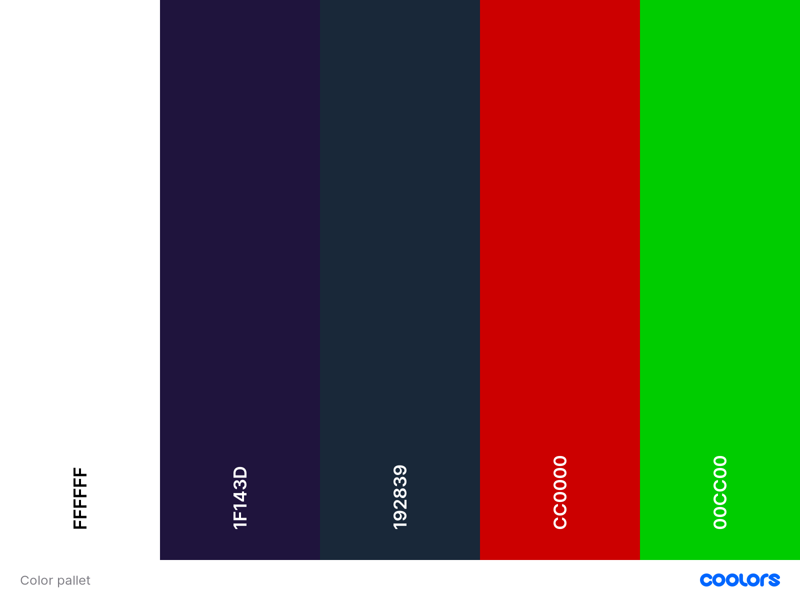

# Get Game Codes #

## A place for gamers to get their game keys ##


## Project goals ##

To give gamers a site where they can buy their favorite game keys, and read or leave reviews about the games they bought or want to buy.

- [UX](#ux)
  - [User Goals](#user-goals)
  - [Scope](#scope)
- [Structure of the website](#structure-of-the-website)
  - [View for a guest user](#view-for-a-guest-user)
  - [View for logged in user](#view-for-logged-in-user)
  - [User Stories](#user-stories)
- [User Requirements and Expectations](#user-requirements-and-expectations)
  - [Requirements](#requirements)
  - [Expectations](#expectations)
- [Design Choices](#design-choices)
  - [Colors](#colors)
  - [Fonts](#fonts)
  - [Icons](#icons)
  - [Structure](#structure)
- [Wireframes and Data Models](#wireframes-and-data-models)
  - [Wireframes](#wireframes)
  - [Data Models](#data-models)
- [Features](#features)
  - [Features that are implemented](#features-that-are-implemented)
  - [Features to be implemented](#features-to-be-implemented)
- [Technologies used](#technologies-used)
  - [Languages](#languages)
  - [Libraries and Frameworks](#libraries-and-frameworks)
- [Front End](#front-end)
- [Back End](#back-end)
  - [Tools](#tools)
- [Testing and Bugs](#testing-and-bugs)
- [Deployment](#deployment)
  - [Local Deployment](#local-deployment)
- [Credit](#credit)
  - [Source credits](#source-credits)
  - [Image credits](#image-credits)
  - [Special thanks](#special-thanks)

## UX ##

### User Goals ###

- The website has to work well on all devices like mobile phones, tables and desktops
- The login procedure should be clear and feedback should be given when appropriate
- The registration process should be clear, easy to do and feedback should be given when appropriate
- The website has to be easy to use and easy to update information
- Visually appealing website

### Scope ###

An easy to navigate and responsive website that is fun to use and allows users as well as site owners, to perform CRUD operations. Users can sign up and, once logged in, they can leave reviews about games. These users can see their purchase history, and manage their account settings.

## Structure of the website ##

### View for a guest user ###

A user that is not logged in and/or registered, will see a homepage with a list of multiple games that they can buy.
The user will be given the option to create an account on every page, where they can view their purchase history and gives them the option to leave reviews on games.

### View for logged in user ###

A logged in user will benefit from the full functionality of the site. The navigation bar will contain an extra button called: 'Logout' when they are logged into their account.
This user is now able to leave reviews on games and add games they want to buy to their wishlist. In the profile tab they can see and change their personal information and view their purchase history.

### User Stories ###

This file is not complete. Changes might be made during development, depending on functionality and usability.

| as a/an…    | I want to be able to…                                                          | So that I can…                                                                                               |
|-------------|--------------------------------------------------------------------------------|--------------------------------------------------------------------------------------------------------------|
| User        | easily navigate the site on mobile, desktop and tablet                         | quickly look if the game I am looking for is on the site                                                     |
|             | view a list of games to buy                                                    | choose something to buy                                                                                      |
|             | read blog posts                                                                | get informed about games I’m planning to buy                                                                 |
|             | easily register for an account                                                 | have a personal account                                                                                      |
|             | sort the list of games                                                         | see best rates, best prices and search product by category                                                   |
|             | sort for specific game category or platform                                    | find best-priced or best-rated product in a specific category                                                |
|             | easily see what I’ve searched for and the Number of results                    | quickly decide whether the product I want is available                                                       |
|             | view the items in my bag                                                       | see what I want to order and what the total cost is                                                          |
|             | enter my payment info easily                                                   | check out quickly without problems                                                                           |
|             | easy to follow payment procedure                                               | order quickly and start gaming                                                                               |
|Logged User  |                                                                                |                                                                                                              |
|             | have my information stored secure                                              | rest assured my personal info is safe                                                                        |
|             | get an order confirmation after checkout                                       | keep a copy for future reference/waranty                                                                     |
|             | easily leave a review                                                          | let people know what I think about the game                                                                  |
|             | easily login or logout                                                         | access my personal account information                                                                       |
|             | easily recover my password in case I forgot                                    | recover access to my account                                                                                 |
|             | receive an email confirmation after registering                                | verify that my account registration was successful                                                           |
|             | have a personalized account page                                               | view my personal order history and order confirmations and save My information                               |
|             | add review                                                                     | give my personal opinion on a game                                                                           |
|             | edit own review                                                                | change my opinion on a game                                                                                  |
|             | delete own review                                                              | remove my opinion on a game                                                                                  |
|Store owner  |                                                                                |                                                                                                              |
|             | add a product                                                                  | add new items to my store                                                                                    |
|             | edit a product                                                                 | edit product details                                                                                         |
|             | delete a product                                                               | delete a product                                                                                             |
|             | add review                                                                     | give my personal opinion on a game                                                                           |
|             | edit review                                                                    | change my opinion on a game                                                                                  |
|             | delete review                                                                  | remove my opinion on a game                                                                                  |
|             |                                                                                |                                                                                                              |

## User Requirements and Expectations ##

### Requirements ###

- Easy to navigate by using buttons in navbar
- functional account page with a good overview
- Easy way to find the game they are looking for
- Ability to save favorite games to wishlist
- Ability to contact the site owner

### Expectations ###

- Registering for an account should be easy and straight forward.
- To have a account page that has a clear overview of games I have bought and my personal info.
- It should be easy and quick to buy an game.

## Design Choices ##

I chose a simple design that doesn't distract users from the main goal of the site, selling games.

### Colors ###

I have used [Coolors](https://coolors.co/) for creating my color scheme.



- FFFFFF : Mainly for text on the site as the backgrounds are dark colors.
- 192839 : As main background color.
- 1F143D : For navbar and footer background.
- CC0000 : Used mainly for important messages or discount icons.
- 00CC00 : Main use is for most buttons on the site.

### Fonts ###

For headers and titles on the site: [Inter](https://fonts.google.com/specimen/Inter?preview.text=Get%20Game%20Codes&preview.text_type=custom)

For main text on the site: [Roboto](https://fonts.google.com/specimen/Roboto)

Fonts are from [Google Fonts.](https://fonts.google.com/)

### Icons ###

Icons used are from [Font Awesome.](https://fontawesome.com/) The are used in moderation and match the colors and overall feel of the design.

Icon used in logo is from [flaticon](https://www.flaticon.com/)

### Structure ###

For the structure I have used [Bootstrap](https://getbootstrap.com/)

## Wireframes and Data Models ##

Wireframes where created at the very beginning of this project, and have been followed as much as possible.

### Wireframes ###

For creating my wireframes I have used [Balsamiq](https://balsamiq.com/)

[Desktop](wireframes/wireframes_desktop.pdf)

[Tablet and Mobile](wireframes/wireframes_tabletmobile.pdf)

### Data Models ###

During the development, I worked with sqlite3 databases, installed with Django. For production I have used [Heroku Postgres](https://elements.heroku.com/addons/heroku-postgresql).

- The User model I have used in this project was provided by Django Allauth. It is a part of default django.contrib.auth.models.

## Features ##

### Features that are implemented ###

- Registration functionality
- Log In and Out functionality
- Able to leave reviews on games when logged in
- Able to add games to wishlist
- Contact site owner
- Having a profile page

- CRUD Functions:
- Create:
  - Account (profile)
  - Review for games
  - Wishlist

- Read:
  - Account (profile)
  - General info (game info, game reviews, purchased games,)
  - Wishlist

- Update:
  - Account(profile)
  - Own reviews on games
  - Wishlist

- Delete:
  - Games from wishlist
  - Account(profile)
  - Own reviews on games

### Features to be implemented ###

**Giftcards:**

- For online gamestores such as: Steam, Epic Games, Psn store. But also for physical gamestores.
For this reason I left the adress and delivery functionality present on the site, even though it is not necessary for the current products available.

**Collector items:**

- Items such as collector editions of games with character statues. This is also a reason why the adress and delivery functionality is still present on the site.

**Game Merch:**

- Selling game merchandise such as t-shirts, hoodies and posters. This as well is a reason why the adress and delivery functionality is still present on the site.

**Ability to change username and delete account completely:**

- I wasn't able to add this feature to the current site due to time constrains. But would like to in the future.

**Newsletter with game news:**

- I wasn't able to add this feature to the current site due to time constrains. But would like to in the future.

## Technologies used ##

### Languages ###

- [HTML](https://developer.mozilla.org/en-US/docs/Web/HTML)
- [CSS](https://developer.mozilla.org/en-US/docs/Web/CSS)
- [JS](https://nl.wikipedia.org/wiki/JavaScript)
- [Python](https://www.python.org/)

### Libraries and Frameworks ###

## Front End ##

- [Font Awesome](https://fontawesome.com/)
- [Bootstrap](https://getbootstrap.com/)
- [Google Fonts](https://fonts.google.com/)
- [jQuery](https://jquery.com/)

## Back End ##

- [Boto3](https://boto3.amazonaws.com/v1/documentation/api/latest/index.html)
- [Pillow](https://pypi.org/project/Pillow/)
- [Gunicorn](https://gunicorn.org/)
- [PEP8](http://pep8online.com/)
- [Stripe](https://stripe.com/en-nl)

### Tools ###

- [Git](https://git-scm.com/)
- [GitPod](https://www.gitpod.io/)
- [Heroku](https://www.heroku.com/)
- [Balsamiq](https://balsamiq.com/)
- [W3C HTML Validation Service](https://validator.w3.org/)
- [W3C CSS Validation Service](https://jigsaw.w3.org/css-validator/)
- [Heroku Postgres](https://elements.heroku.com/addons/heroku-postgresql)
- [Gimp](https://www.gimp.org/)
- [Tinypng](https://tinypng.com/)
- [Paint 3D](https://www.microsoft.com/en-us/p/paint-3d/9nblggh5fv99?activetab=pivot:overviewtab)
- [Responsively.app](https://responsively.app/)
- [Table of content](http://ecotrust-canada.github.io/markdown-toc/)

## Testing and Bugs ##

### During development ###

**When trying to delete a product from a users wishlist an error occured:**

- *Error:* MultipleObjectsReturned at /wishlist/delete/2; get() returned more than one WishlistItem -- it returned 2!

- *Cause:* The get request tries to get the product requested out of all the wishlists where the product is saved in. So when more then 1 user has the same product saved in their wishlist, this error occurs.

- *Solution:* Added 'wishlist_id=wishlist_user' to get request, to specify out of wich wishlist the product has to be removed.

**While styling footer to stay on the bottom of the page. The footer aligned right on the profile page only.**

- *Cause:* Have not found the direct cause of why it is aligning right only on that page. It might have taken some styling from the content above it somehow.

- *Solution:* Wrapping the block content in base.hmtl inside a empty div has resolved the issue. Most likely because this seperated the content from the footer completely, making sure the footer does not take on any styling from the content.  

## Deployment ##

GetGameCodes was developed using the GitPod online IDE and using Git & GitHub for version control.
It is hosted on the **Heroku** platform, with static files and images being hosted in **AWS S3 Basket**.

### Local Deployment ###

To be able to run this project, the following tools have to be installed:

- An IDE of your choice (I used GitPod for creating this project)
- Git
- PIP
- Python3

Apart from that, you also need to create accounts with the following services:

- [Stripe](stripe.com/)
- [AWS](aws.amazon.com/) to setup the S3 bucket
- [Gmail](http://mail.google.com/mail?hl=nl)

To **clone** the project:

- You can **clone** this repository directly into the editor of your choice by pasting the following command into the terminal:

``` git clone https://github.com/ThomasMSmit/GetGameCodes ```

Alternatively, you can **save** a copy of this repository by clicking the green button **Clone** or **download** , then **Download Zip** button, and after extract the Zip file to your folder.

In the terminal window of your local IDE change the directory (CD) to the correct file location (directory that you have just created).

Note: You can read more information about the cloning process on the [GitHub Help page](https://docs.github.com/en).

- Set up environment variables.

Note, that this process will be different depending on IDE you use.

In this IDE it was done using the following steps:

``` pip install python-dotenv ```

- Add .env to the .gitignore file in your project's root directory
- In .env file set environment variables with the following syntax:

| KEY                   | VALUE       |
|-----------------------|-------------|
| DEVELOPMENT           | development |
| SECRET_KEY            | secret key  |
| STRIPE_PUBLIC_KEY     | secret key  |
| STRIPE_SECRET_KEY     | secret key  |
| STRIPE_SECRET_KEY     | secret key  |
| EMAIL_HOST_USER       | secret      |
| EMAIL_HOST_PASSWORD   | secret      |
| DATABASE_URL          | url         |
| AWS_ACCESS_KEY_ID     | secret key  |
| AWS_SECRET_ACCESS_KEY | secret key  |
| AWS_S3_CUSTOM_DOMAIN  | url         |

- Add the following to your **settings.py**

```from dotenv import load_dotenv```
```load_dotenv()```

- Read more about how to **set up** the Stripe keys in the [Stripe Documentation](https://stripe.com/docs/keys).

Call your variables either with ```os.getenv()``` or ```os.environ.get()```
In settings.py:

| import OS  |                                |
|------------|--------------------------------|
| SECRET_KEY | = os.environ.get("SECRET_KEY") |
| DEBUG      | = "DEVELOPMENT" in os.environ  |

Note that **DEBUG** will be **True** if there's a **DEVELOPMENT key/value pair** in your .env file, regardless of
its value (i.e. if it has any value it will be True).
This means that **DEBUG** will be **False** in production, unless the **DEVELOPMENT** variable is added to the
production host's environment variables.
Don't forget to add .env to your .gitignore and **never track it with version control**!

- Install all requirements from the requirements.txt file putting this command into your terminal:

``` pip3 install -r requirements.txt ```

- In the terminal in your IDE migrate the models to crete a database using the following commands:

``` python3 manage.py makemigrations ```

``` python3 manage.py migrate ```

- Create a Procfile, in order to tell Heroku how to run the project, using the following command in the terminal:

```web: gunicorn getgamecodes.wsgi:application```

- git add, git commit and git push these files to GitHub repository.

**NOTE:** these 1-3 steps are already done in this project and included in the **GitHub repository**, but illustrated here as they are required for the **successful** deployment to **Heroku**.
As well as that, other things that are required for the Heroku deployment and have to be installed: **gunicorn (WSGI HTTP Server)**, **dj-database-url** for database connection and **Psycopg** (PostgreSQL driver for Python).
All of the mentioned above are already installed in this project in the requirements.txt file.

- On the [Heroku](heroku.com/) website you need to create a **new app**, assign a name (must be unique),set a region to the **closest** to you (for my project I set Europe) and click **Create app**.
- Go to Resources tab in **Heroku**, then in the **Add-ons search bar** look for **Heroku Postgres**(you can type postgres), select **Hobby Dev — Free** and click **Provision** button to add it to your project.
- In **Heroku Settings** click on **Reveal Config Vars**.
- Set the following config variables there:

| KEY                  | Value    |
| :-------------       | :---------- |
|AWS_ACCESS_KEY_ID     | your aws access key  |
|AWS_SECRET_ACCESS_KEY | your aws secret access key |
|DATABASE_URL          |  your postgres database url|
|EMAIL_HOST_PASS       |  your email password(generated by Gmail)|
|EMAIL_HOST_USER       |  your email address|
|SECRET_KEY            |  your secret key|
|STRIPE_PUBLIC_KEY     |  your stripe public key|
|STRIPE_SECRET_KEY     |  your stripe secret key|
|STRIPE_WH_SECRET      |  your stripe wh key|
|USE_AWS               |  True|

- Copy **DATABASE_URL's** value(Postgres database URL) from the **Convig Vars** and **temporary** paste it into the default database in settings.py.

You can temporary comment out the current database settings code and just paste the following in the settings.py:

```python
  DATABASES = {
    'default': dj_database_url.parse("your Postgres database URL here")
  }
  ```

Important Note:

That's just **temporary set up**, this URL should **not be committed** and published to GitHub for **security reasons**, so make sure **not to commit your changes to Git while the URL is in the settings.py**.

- Migrate the **database models** to the **Postgres database** using the following commands in the terminal:

``` python3 manage.py makemigrations ```

``` python3 manage.py migrate ```

- Load the **data fixtures in this specific order**, because one relies on the other (categories, workshops, therapists, comments, blog) into the **Postgres database** using the following command:

``` python3 manage.py loaddata <fixture_name> ```

- Create a **superuser** for the Postgres database by running the following command (you need to follow the instructions and inserting username, email and password):

``` python3 manage.py createsuperuser ```

- You need to **remove** your Postgres URL database from the settings and **uncomment** the default DATABASE settings code in the settings.py file.

Note: for production you get the environment variable 'DATABASE_URL' from the Heroku Config Vars and use Postgress database, while for development you use the SQLite as a default database.

- Add your **Heroku app URL** to **ALLOWED_HOSTS** in the settings.py file.

- You can connect **Heroku** to **GitHub** to automatically deploy each time you **push** to GitHub. But be **aware** that if you use **AWS** to host your static and media files, automatic deployment **may result** in being **billed** if you are on a free account.

To do so, from the [Heroku dashboard](https://dashboard.heroku.com/) follow the steps:

- Deploy section -> Deployment method -> select GitHub
- Link the **Heroku app** to **your GitHub repository** for this project
- Click **Enable Automatic Deploys** in the **Automatic Deployment section**
- Run **git push** command in the terminal, that would now **push your code to both Github and Heroku**, and perform the **deployment**.

Alternatively, in the terminal you can run:

``` heroku login -i ```

- After adding and committing to Git, run the following command:

``` git push heroku main ```

- After successful deployment, you can view your app by clicking **Open App** on Heroku platform.
- You will also need to **verify your email address**, so you need to **login** with your **superuser credentials** and **verify your email address** in the admin panel. Now you will be able to **view the app** running!

Hosting media files with AWS

The static files and media files (that will be uploaded by superuser - product/service images) are hosted in the AWS S3 Bucket. To host them, you need to create an account in AWS and create your S3 bucket with public access. More about setting it up you can read in [Amazon S3 documentation](https://docs.aws.amazon.com/s3/index.html) and [this](https://www.youtube.com/watch?v=e6w9LwZJFIA) tutorial.

Sending email via Gmail

In order to **send** real emails from the application, you need to **connect** it to your Gmail account, setting up your email address in ```EMAIL_HOST_USER``` variable and your **app password** generated by your email provider in ```EMAIL_HOST_PASS``` variable.

## Credit ##

### Content credits ###

**All content, games titles, trade names and/or trade dress, trademarks, artwork and associated imagery are trademarks and/or copyright material of their respective owners. All rights reserved.**

[Thegamesdb](https://thegamesdb.net/) for game titles and descriptions.

[PcGamer](https://www.pcgamer.com/playing-god-of-war-on-ps-now-made-me-rage-harder-than-kratos/) for the God Of War article on the homepage.

[GamerRadar](https://www.gamesradar.com/uk/assassins-creed-valhalla-gets-free-ezio-outfit-for-eivor/) for Assassin's Creed Valhalla article on the homepage.

[ScreenRant](https://screenrant.com/super-smash-bros-ultimate-best-characters-to-play/) for the Super Smash Bros. Ultimate article on the homepage.

[RacingGames](https://racinggames.gg/f1/f1-2021-release-date-gameplay-trailer-early-access-my-team-tracks-editions-price-uk-ps5-xbox-pc-steam/) for the F1 2021 article on the homepage.

### Source credits ###

[Keis Gerhardt Smit](https://github.com/KeisGSmit) for the wishlist.

[Ken Walsh](https://github.com/kenwals) for the review model.

[Bootdey](https://www.bootdey.com/snippets/view/latest-news-widget) for the latest news layout.

### Image credits ###

I used [Paint 3D](https://www.microsoft.com/en-us/p/paint-3d/9nblggh5fv99?activetab=pivot:overviewtab) for creating my [logo](media/logo.png)
The icon used in the logo is from [flaticon](https://www.flaticon.com/)

[PcGamer](https://www.pcgamer.com/playing-god-of-war-on-ps-now-made-me-rage-harder-than-kratos/) Article image

[GamerRadar](https://www.gamesradar.com/uk/assassins-creed-valhalla-gets-free-ezio-outfit-for-eivor/) Article image

[ScreenRant](https://screenrant.com/super-smash-bros-ultimate-best-characters-to-play/) Article image

[RacingGames](https://racinggames.gg/f1/f1-2021-release-date-gameplay-trailer-early-access-my-team-tracks-editions-price-uk-ps5-xbox-pc-steam/) Article image

### Special thanks ###

A thank you to [Keis Gerhardt Smit](https://github.com/KeisGSmit) for his Gymshop project, that helped me create my wishlist model.

A thank you to [Ken Walsh](https://github.com/kenwals) for his BoWood-Audio project, that helped me create my review model.

**Site for educational purposes only!**
